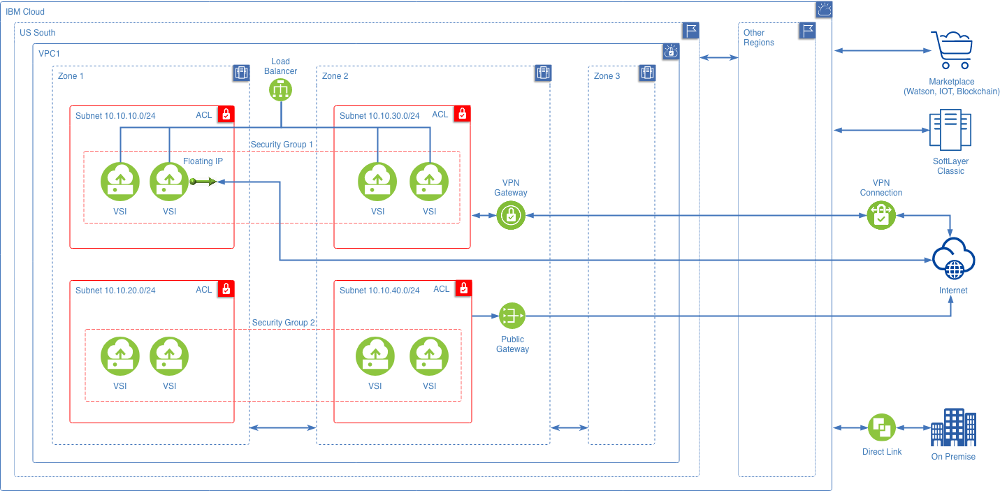

---
copyright:
  years: 2017, 2019
lastupdated: "2019-01-24"
---

{:shortdesc: .shortdesc}
{:codeblock: .codeblock}
{:screen: .screen}
{:new_window: target="_blank"}
{:pre: .pre}
{:tip: .tip}
{:note: .note}
{:important: .important}
{:download: .download}
{:table: .aria-labeledby="caption"}
{:DomainName: data-hd-keyref="DomainName"}

# About IBM Cloud Virtual Private Cloud (VPC) Infrastructure

{{site.data.keyword.cloud}} VPC is part of the next generation of the IBM One Cloud platform, which redefines the traditional industry standards for performance, service growth, flexibility, and deployment freedom.

A Virtual Private Cloud (VPC) gives you a cost-effective entry point that provides cloud security and the ability to scale dynamically in a public cloud. It offers fine-grained control over your virtual infrastructure and your network traffic segmentation.

## Private space in a public cloud
IBM Cloud VPC offers an isolated, security-rich environment within the public cloud. It gives you the security of a private cloud, with the agility and ease of a public cloud.

 * You can manage key network services and launch Virtual Servers as needed to support your mission-critical, cloud-tolerant, and cloud-native applications.
 * You can define your own networking policies designed for security and convenient access.
 * You can provision your resources and connect them to each other, or you can isolate them from one another.

### Logical isolation
The IBM Cloud Virtual Private Cloud (VPC) gives your applications logical isolation from other networks in all regions, while providing scalability and security.

To make this logical isolation possible, the VPC is divided into subnets, using a range of private IP addresses. However, by default, all resources (such as VSIs) within the same Virtual Private Cloud can communicate to each other, regardless of their subnet. Subnets are contained within a single zone, and they cannot span multiple zones, which helps with security, with reducing latency, and with disaster recovery.

### Quick instance provisioning and security

Create virtual server instances (VSIs) quickly, using pre-defined profiles optimized for your specific workloads. Protect your instances with security groups.

### Networking capabilities
IBM Cloud VPC offers comprehensive networking capabilities, including IP address range selection, virtual firewalls (security groups and network ACLs), site-to-site virtual private networks (VPN), and load balancing (LBaaS) with elasticity.

 * You can configure your virtual topology automatically, using suggested prefix ranges and pre-configured network policies.
 * You can customize your IBM Cloud VPC and adapt it to your changing requirements, seamlessly.
 * You can bring your own private IP and assign floating IP.
 * Load balancing and VPN have multi-region control planes, which means that each region where the control plane is deployed can support all regions for a customer's virtual server instances. A failure in a single region will not impact the service in any other region.

### Global connectivity
You can scope your applications and available resources locally or globally, without bounds, to span across multiple regions. Using VPN, you can create private connections to other projects and other portions of your hybrid cloud deployments.

### Network security
Security is integrated into your IBM Cloud VPC, with security groups that act as virtual firewalls for instance-level protection, and with network access control lists (ACLs) for subnet-level protection.

### Load balancing
Within your IBM Cloud VPC, use load balancing to distribute your network traffic across a set of targets to improve performance and HA. Load Balancers also monitor the health of your applications and services. You can set up a load balancer to distribute incoming application traffic across instances in a single zone or across multiple zones within a region.

### Internet access
Two options are available for enabling communications from your virtual server instances (VSIs) to the public internet:
* Use a public gateway (PGW) to enable communication for all virtual server instances on the attached subnet. There is no charge for using a PGW, except for the bandwidth used.
* Use a Floating IP (FIP) to enable communication from a single virtual server instance (VSI).

**Figure: An example IBM Cloud VPC configuration**

## Supporting cloud-native workloads

A Virtual Private Cloud is ideal for cloud-native workloads and for linking your existing infrastructure into IBM Cloud. You can create the best cloud for all of your important workloads such as cognitive, AI, and Machine Learning computations. Meanwhile, you can continue to utilize IBM Cloud Classic for traditional workloads, as desired.

Here are some ways that VPC supports your hybrid, cloud-tolerant, and cloud-native workloads:

 * Create and manage isolated application environments through an API
 * Design network topologies with BYOIP (Bring Your Own IP)
 * Utilize Security Groups and Network Access Control List (ACLs) to allow flexible, API-driven topologies
 * Availability Zones allow high-speed & low-latency connections across regions, with HA
 * Auto-scaling
   * Scale up or down by thousands of servers per day
   * Use scalable and reliable load balancing with certificate management
   * Establish scalable and reliable monitoring
   * Maintain the illusion of infinite capacity for your clients
 * Utilize high-speed networking and storage devices
 * Allow Always On services (control plane)
 * Cover multiple regions for disaster recovery and resilience
 * Provide and utilize core services:  IPAM, VPN, firewalls, SSH, DNS, and L4 Load Balancing
 * Set up other services: auto-scaling, CDNs, 3rd-party NFV
 * Allow fast VSI provisioning with affinity and anti-affinity
 * Use flexible image management with pre-stored images
 * Give support for GPUs

## Summary of benefits

 * Quick to get started using predefined configurations for your instances, called profiles
 * Flexible geographic scope with zones and regions available globally
 * Secure from the ground up, with ACLs and security groups
 * Easily scalable and sharable, a VPC network and resources can stretch from your on-premise facility into your cloud
 * Monitor your workloads for optimal performance and efficiency

## Summary of features

  * Create subnets, and bring your own private IP (BYOIP)
  * Create and manage Virtual Server Instances (VSIs) using Ubuntu 16.04, CentOS 7.x, Windows, or Debian
  * Reserve and associate a Floating IPv4
  * Get Internet access to subnets by creating a public gateway (PGW), one per Zone
  * Create and assign security groups to your VSIs
  * Use network access control lists (ACLs) to provide security for your subnets
  * Single-homed VSIs, using one virtual network interface card (vNIC)
  * Multi-homed, multi-vNIC Virtual Server Instances (VSIs)
  * Zone deployment, in US-South region or FRA region
  * Internet access by VPN
  * Load Balancing (LB) that's native to VPC

## BYOIP Caveats

You can bring your own public IPv4 address range (BYOIP) to your IBM Cloud VPC account. When you use BYOIP, IBM Cloud must configure those IPv4 addresses on IBM Cloud resources, which will send packets to and from the addresses you've provided. Therefore, as a result of using your supplied IPv4 range on IBM Cloud, these IP addresses may be exposed to IBM's support staff and third parties as part of your use of this service.
{: important}

You must use the API or the CLI to use BYOIP. This advanced capability is not available through the IBM Cloud console UI.
{: note}

## Known Limitations
 
For a full list of known limitations and features not currently supported, please refer to [the Known Limitations](known-limitations.html) document.

## Learn more
  
* [**IBM VPC terminology**](/docs/infrastructure/vpc/vpc-glossary.html)
* [**IBM VPC security**](/docs/infrastructure/vpc-network/vpc-security.html)
* [**IBM VPC regions and subnets available**](/docs/infrastructure/vpc-network/vpc-regions-and-subnets.html)
* [**Creating and managing network resources in VPC**](/docs/infrastructure/vpc/create-manage-network.html)
* [**Creating and managing virtual server instances**](/docs/infrastructure/vpc/create-manage-vsi.html)
